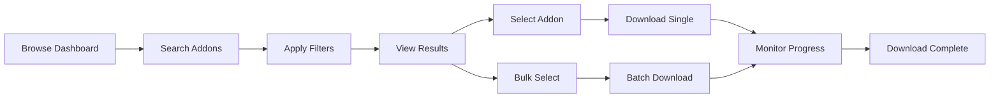
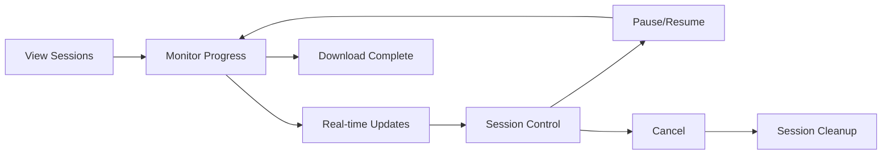
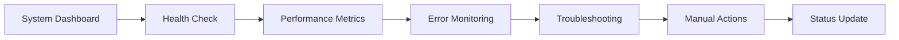

# SceneryAddonsDB - Comprehensive UI Architecture Plan

## Executive Summary

This document presents a comprehensive plan for developing a robust web-based user interface for the SceneryAddonsDB API. Based on detailed analysis of the backend architecture, this plan outlines the recommended technology stack, component architecture, user workflows, and integration strategies for creating a modern, responsive, and feature-rich frontend application.

### Key Findings from API Analysis

The SceneryAddonsDB API provides a sophisticated backend with:
- **Complete CRUD Operations**: Full addon management with advanced filtering and pagination
- **Real-time Download Management**: Session-based downloads with BitTorrent integration
- **SignalR Integration**: Real-time progress tracking and notifications
- **Comprehensive Monitoring**: System health, statistics, and reporting capabilities
- **Background Processing**: Automated scraping and data synchronization

### Recommended Solution

A React 18 + TypeScript SPA with SignalR integration, optimized for real-time download management and large dataset handling, following the existing UI specification with enhancements for newly discovered capabilities.

---

## API Analysis Summary

### Complete Endpoint Inventory

#### Addon Management (`/api/addons`)
- `GET /api/addons` - Advanced filtering, pagination, search, sorting
- `GET /api/addons/latest` - Latest addons with configurable count
- `GET /api/addons/compatibility` - Compatibility lookup by filename
- `GET /api/addons/stats` - Basic addon statistics

#### Download Management (`/api/downloads`)
- `POST /api/downloads/start` - Start download session with concurrency control (1-10)
- `POST /api/downloads/addon/{id}` - Download specific addon
- `GET /api/downloads/sessions` - List all active sessions
- `GET /api/downloads/sessions/{id}/status` - Real-time session status
- `POST /api/downloads/sessions/{id}/pause` - Pause session
- `POST /api/downloads/sessions/{id}/cancel` - Cancel session
- `GET /api/downloads/stats` - Download statistics and metrics
- `GET /api/downloads/folders` - Downloaded files organized by compatibility

#### System Monitoring
- `GET /api/health` - Simple health check
- `GET /api/reports/status` - Comprehensive system status
- `POST /api/scraper/refresh` - Manual scraping trigger (authenticated)

#### Real-time Communication
- SignalR Hub (`/downloadProgressHub`) with session-based groups
- Progress updates, completion notifications, global statistics

### Data Models Identified

#### Core Addon Entity
```typescript
interface Addon {
  id: string;
  fileName: string;        // Unique identifier
  name: string;           // Display name
  compatibility: string;  // "MSFS 2020", "MSFS 2024", "MSFS 2020/2024"
  dateAdded: Date;
  lastUpdated: Date;
}
```

#### Download Session Management
```typescript
interface DownloadSession {
  sessionId: string;
  status: 'Active' | 'Completed' | 'CompletedWithErrors' | 'Cancelled';
  totalItems: number;
  completedItems: number;
  failedItems: number;
  activeDownloads: number;
  overallProgress: number;
  totalSpeedBytesPerSecond: number;
  items: DownloadItem[];
  startedAt: Date;
  completedAt?: Date;
}
```

#### Advanced Filtering Capabilities
```typescript
interface SearchFilters {
  query: string;
  compatibility: string[];
  dateRange: { start: Date; end: Date };
  sortBy: 'dateAdded' | 'name' | 'compatibility';
  sortOrder: 'asc' | 'desc';
  page: number;
  pageSize: number;
}
```

---

## Technology Stack Recommendations

### Core Framework & Language
```json
{
  "framework": "React 18",
  "language": "TypeScript",
  "bundler": "Vite",
  "package_manager": "npm"
}
```

### UI & Styling
```json
{
  "styling": "Tailwind CSS 4.0",
  "components": "Headless UI",
  "icons": "Lucide React",
  "animations": "Framer Motion"
}
```

### State Management & Data Fetching
```json
{
  "server_state": "React Query (TanStack Query)",
  "client_state": "Zustand",
  "forms": "React Hook Form",
  "validation": "Zod",
  "real_time": "@microsoft/signalr"
}
```

### Development & Testing
```json
{
  "testing": "Vitest + React Testing Library",
  "e2e": "Playwright",
  "linting": "ESLint + Prettier",
  "type_checking": "TypeScript strict mode"
}
```

### API Integration
```json
{
  "http_client": "Axios",
  "api_types": "OpenAPI generated TypeScript definitions",
  "real_time": "SignalR Client with auto-reconnection"
}
```

---

## Component Architecture

### Application Structure
```
src/
├── components/
│   ├── ui/                 # Base UI components
│   │   ├── Button/
│   │   ├── Input/
│   │   ├── Modal/
│   │   └── ProgressBar/
│   ├── layout/            # Layout components
│   │   ├── AppLayout/
│   │   ├── Sidebar/
│   │   ├── Header/
│   │   └── ContentArea/
│   ├── addon/             # Addon-specific components
│   │   ├── AddonCard/
│   │   ├── AddonGrid/
│   │   ├── AddonFilters/
│   │   └── AddonSearch/
│   ├── download/          # Download management
│   │   ├── SessionManager/
│   │   ├── SessionCard/
│   │   ├── ProgressTracker/
│   │   └── DownloadHistory/
│   └── system/            # System monitoring
│       ├── HealthDashboard/
│       ├── StatsCards/
│       └── LogViewer/
├── pages/                 # Page components
│   ├── Dashboard/
│   ├── AddonBrowser/
│   ├── DownloadManager/
│   └── SystemStatus/
├── hooks/                 # Custom React hooks
│   ├── useAddons/
│   ├── useDownloadSessions/
│   ├── useSignalR/
│   └── useFilters/
├── services/              # API services
│   ├── api/
│   │   ├── addons.ts
│   │   ├── downloads.ts
│   │   └── system.ts
│   ├── signalr/
│   │   └── connection.ts
│   └── storage/
│       └── preferences.ts
├── stores/               # Zustand stores
│   ├── uiStore.ts
│   ├── filtersStore.ts
│   └── preferencesStore.ts
├── types/               # TypeScript definitions
│   ├── api.ts
│   ├── ui.ts
│   └── signalr.ts
└── utils/               # Utility functions
    ├── formatting.ts
    ├── validation.ts
    └── constants.ts
```

### Key Component Specifications

#### 1. Dashboard Page Components

##### MetricsGrid
```typescript
interface MetricsGridProps {
  metrics: {
    totalAddons: number;
    recentAddons: number;
    activeDownloads: number;
    completedDownloads: number;
    systemHealth: 'healthy' | 'warning' | 'error';
  };
  onRefresh: () => void;
  loading?: boolean;
}
```

##### ActivityFeed
```typescript
interface ActivityFeedProps {
  activities: Activity[];
  maxItems?: number;
  onItemClick?: (item: Activity) => void;
  realTime?: boolean;
}
```

#### 2. Addon Browser Components

##### AddonGrid
```typescript
interface AddonGridProps {
  addons: Addon[];
  loading?: boolean;
  error?: string;
  onAddonSelect: (addon: Addon) => void;
  onBulkDownload: (addons: Addon[]) => void;
  selectedAddons: Set<string>;
  onSelectionChange: (selected: Set<string>) => void;
}
```

##### AddonFilters
```typescript
interface AddonFiltersProps {
  filters: SearchFilters;
  onFiltersChange: (filters: SearchFilters) => void;
  compatibilityOptions: string[];
  onReset: () => void;
  isOpen: boolean;
  onToggle: () => void;
}
```

#### 3. Download Manager Components

##### SessionManager
```typescript
interface SessionManagerProps {
  sessions: DownloadSession[];
  onPauseSession: (sessionId: string) => void;
  onCancelSession: (sessionId: string) => void;
  onRetrySession: (sessionId: string) => void;
  realTimeUpdates: boolean;
}
```

##### ProgressTracker
```typescript
interface ProgressTrackerProps {
  session: DownloadSession;
  item: DownloadItem;
  onItemAction: (action: 'pause' | 'cancel' | 'retry', itemId: string) => void;
  showDetails?: boolean;
}
```

---

## User Workflows

### Primary User Journeys

#### 1. Addon Discovery & Download


#### 2. Download Session Management


#### 3. System Monitoring


### Detailed Workflow Specifications

#### Addon Browser Workflow
1. **Initial Load**: Display paginated addon list with default sorting
2. **Search**: Real-time search with 300ms debounce
3. **Filter**: Apply compatibility, date range, and text filters
4. **Sort**: Multiple sort options with direction toggle
5. **Select**: Single or multi-select with visual feedback
6. **Download**: Individual or bulk download initiation
7. **Feedback**: Loading states, success/error notifications

#### Download Management Workflow
1. **Session Creation**: Configure download parameters
2. **Progress Monitoring**: Real-time progress updates via SignalR
3. **Session Control**: Pause, resume, cancel operations
4. **Error Handling**: Retry mechanisms for failed downloads
5. **Completion**: Success notifications and file organization
6. **History**: View completed and failed downloads

---

## Data Integration Strategies

### API Client Architecture

#### HTTP Client Setup
```typescript
// Base API client configuration
const apiClient = axios.create({
  baseURL: 'http://localhost:5269/api',
  timeout: 30000,
  headers: {
    'Content-Type': 'application/json',
  },
});

// Request interceptor for auth and logging
apiClient.interceptors.request.use(
  (config) => {
    // Add auth token if available
    // Log request details
    return config;
  },
  (error) => Promise.reject(error)
);

// Response interceptor for error handling
apiClient.interceptors.response.use(
  (response) => response,
  (error) => {
    // Handle network errors
    // Transform error messages
    // Trigger retry logic
    return Promise.reject(error);
  }
);
```

#### React Query Integration
```typescript
// Addon queries
export const useAddons = (filters: SearchFilters) => {
  return useQuery({
    queryKey: ['addons', filters],
    queryFn: () => addonApi.getAddons(filters),
    staleTime: 5 * 60 * 1000, // 5 minutes
    cacheTime: 10 * 60 * 1000, // 10 minutes
    keepPreviousData: true,
  });
};

// Download session queries
export const useDownloadSessions = () => {
  return useQuery({
    queryKey: ['downloadSessions'],
    queryFn: () => downloadApi.getSessions(),
    refetchInterval: 5000, // Refresh every 5 seconds
    refetchIntervalInBackground: true,
  });
};
```

### SignalR Integration

#### Connection Management
```typescript
class SignalRService {
  private connection: HubConnection | null = null;
  
  async connect(): Promise<void> {
    this.connection = new HubConnectionBuilder()
      .withUrl('http://localhost:5269/downloadProgressHub')
      .withAutomaticReconnect({
        nextRetryDelayInMilliseconds: retryContext => {
          return Math.min(1000 * Math.pow(2, retryContext.previousRetryCount), 30000);
        }
      })
      .build();
    
    await this.connection.start();
    this.setupEventHandlers();
  }
  
  private setupEventHandlers(): void {
    this.connection?.on('ProgressUpdate', (progress: DownloadStatusResponse) => {
      // Update React Query cache
      queryClient.setQueryData(['downloadSession', progress.sessionId], progress);
    });
    
    this.connection?.on('SessionCompleted', (sessionId: string) => {
      // Show success notification
      // Invalidate related queries
    });
  }
}
```

#### Real-time State Integration
```typescript
// Custom hook for real-time download progress
export const useDownloadProgress = (sessionId: string) => {
  const [progress, setProgress] = useState<DownloadStatusResponse | null>(null);
  
  useEffect(() => {
    const connection = signalRService.getConnection();
    
    connection?.invoke('JoinSessionGroup', sessionId);
    
    connection?.on('ProgressUpdate', (update: DownloadStatusResponse) => {
      if (update.sessionId === sessionId) {
        setProgress(update);
      }
    });
    
    return () => {
      connection?.invoke('LeaveSessionGroup', sessionId);
      connection?.off('ProgressUpdate');
    };
  }, [sessionId]);
  
  return progress;
};
```

### State Management Strategy

#### Zustand Store Architecture
```typescript
// UI state store
interface UIState {
  sidebarOpen: boolean;
  selectedAddons: Set<string>;
  filterPanelOpen: boolean;
  actions: {
    toggleSidebar: () => void;
    toggleAddonSelection: (id: string) => void;
    clearSelection: () => void;
    toggleFilterPanel: () => void;
  };
}

// Filter state store
interface FilterState {
  filters: SearchFilters;
  actions: {
    updateFilters: (filters: Partial<SearchFilters>) => void;
    resetFilters: () => void;
    applyPreset: (preset: FilterPreset) => void;
  };
}
```

---

## Real-time Features Implementation

### SignalR Event Handling

#### Progress Updates
```typescript
// Real-time progress component
const ProgressTracker: React.FC<ProgressTrackerProps> = ({ sessionId }) => {
  const progress = useDownloadProgress(sessionId);
  
  return (
    <div className="space-y-4">
      <div className="flex items-center justify-between">
        <span>Overall Progress</span>
        <span>{progress?.overallProgress.toFixed(1)}%</span>
      </div>
      
      <ProgressBar
        value={progress?.overallProgress ?? 0}
        className="h-2"
        animated={progress?.status === 'Active'}
      />
      
      <div className="grid grid-cols-2 gap-4 text-sm">
        <div>Active: {progress?.activeDownloads}</div>
        <div>Completed: {progress?.completedItems}</div>
        <div>Failed: {progress?.failedItems}</div>
        <div>Speed: {formatBytes(progress?.totalSpeedBytesPerSecond ?? 0)}/s</div>
      </div>
    </div>
  );
};
```

#### Notification System
```typescript
// Global notification handler
const useSignalRNotifications = () => {
  const { toast } = useToast();
  
  useEffect(() => {
    const connection = signalRService.getConnection();
    
    connection?.on('SessionCompleted', (sessionId: string) => {
      toast({
        title: 'Download Complete',
        description: `Session ${sessionId} completed successfully`,
        variant: 'success',
      });
    });
    
    connection?.on('SessionFailed', (sessionId: string, error: string) => {
      toast({
        title: 'Download Failed',
        description: `Session ${sessionId} failed: ${error}`,
        variant: 'destructive',
      });
    });
    
    return () => {
      connection?.off('SessionCompleted');
      connection?.off('SessionFailed');
    };
  }, [toast]);
};
```

### Live Dashboard Updates

#### Real-time Metrics
```typescript
// Live dashboard metrics
const LiveMetrics: React.FC = () => {
  const [metrics, setMetrics] = useState<DashboardMetrics>();
  
  useEffect(() => {
    const connection = signalRService.getConnection();
    
    connection?.on('StatsUpdate', (stats: DashboardMetrics) => {
      setMetrics(stats);
    });
    
    return () => connection?.off('StatsUpdate');
  }, []);
  
  return (
    <div className="grid grid-cols-1 md:grid-cols-2 lg:grid-cols-4 gap-6">
      <MetricCard
        title="Total Addons"
        value={metrics?.totalAddons ?? 0}
        icon={Package}
        color="blue"
      />
      <MetricCard
        title="Active Downloads"
        value={metrics?.activeDownloads ?? 0}
        icon={Download}
        color="green"
        animated
      />
      <MetricCard
        title="Completed Today"
        value={metrics?.completedToday ?? 0}
        icon={CheckCircle}
        color="purple"
      />
      <MetricCard
        title="System Health"
        value={metrics?.systemHealth ?? 'Unknown'}
        icon={Heart}
        color={metrics?.systemHealth === 'healthy' ? 'green' : 'red'}
      />
    </div>
  );
};
```

---

## Performance Optimization

### Large Dataset Handling

#### Virtual Scrolling
```typescript
// Virtual scrolling for large addon lists
const VirtualizedAddonGrid: React.FC<VirtualizedAddonGridProps> = ({
  addons,
  onAddonSelect,
}) => {
  const containerRef = useRef<HTMLDivElement>(null);
  const [visibleRange, setVisibleRange] = useState({ start: 0, end: 20 });
  
  const itemHeight = 280; // Fixed height for addon cards
  const containerHeight = 600;
  
  const handleScroll = useCallback(
    throttle((scrollTop: number) => {
      const start = Math.floor(scrollTop / itemHeight);
      const end = start + Math.ceil(containerHeight / itemHeight) + 1;
      setVisibleRange({ start, end });
    }, 16)
  );
  
  const visibleAddons = addons.slice(visibleRange.start, visibleRange.end);
  
  return (
    <div
      ref={containerRef}
      className="h-[600px] overflow-auto"
      onScroll={(e) => handleScroll(e.currentTarget.scrollTop)}
    >
      <div style={{ height: addons.length * itemHeight }}>
        <div
          style={{
            transform: `translateY(${visibleRange.start * itemHeight}px)`,
          }}
        >
          {visibleAddons.map((addon, index) => (
            <AddonCard
              key={addon.id}
              addon={addon}
              onSelect={onAddonSelect}
              style={{ height: itemHeight }}
            />
          ))}
        </div>
      </div>
    </div>
  );
};
```

#### Pagination Strategy
```typescript
// Optimized pagination with prefetching
const usePaginatedAddons = (filters: SearchFilters) => {
  const { data, isLoading, error } = useQuery({
    queryKey: ['addons', filters],
    queryFn: () => addonApi.getAddons(filters),
    keepPreviousData: true,
  });
  
  // Prefetch next page
  const queryClient = useQueryClient();
  
  useEffect(() => {
    if (data?.pagination.hasNext) {
      const nextFilters = { ...filters, page: filters.page + 1 };
      queryClient.prefetchQuery({
        queryKey: ['addons', nextFilters],
        queryFn: () => addonApi.getAddons(nextFilters),
      });
    }
  }, [data, filters, queryClient]);
  
  return { data, isLoading, error };
};
```

### Caching Strategy

#### React Query Configuration
```typescript
// Optimized query configuration
const queryClient = new QueryClient({
  defaultOptions: {
    queries: {
      staleTime: 5 * 60 * 1000, // 5 minutes
      cacheTime: 10 * 60 * 1000, // 10 minutes
      retry: (failureCount, error) => {
        if (error.response?.status === 404) return false;
        return failureCount < 3;
      },
      retryDelay: (attemptIndex) => Math.min(1000 * 2 ** attemptIndex, 30000),
    },
    mutations: {
      onError: (error) => {
        // Global error handling
        toast.error('Operation failed. Please try again.');
      },
    },
  },
});
```

#### Local Storage Integration
```typescript
// Persistent user preferences
const usePersistedFilters = () => {
  const [filters, setFilters] = useState<SearchFilters>(() => {
    const saved = localStorage.getItem('addon-filters');
    return saved ? JSON.parse(saved) : defaultFilters;
  });
  
  useEffect(() => {
    localStorage.setItem('addon-filters', JSON.stringify(filters));
  }, [filters]);
  
  return [filters, setFilters] as const;
};
```

---

## Error Handling & User Experience

### Error Boundary Implementation
```typescript
// Global error boundary
class ErrorBoundary extends React.Component<
  { children: React.ReactNode },
  { hasError: boolean; error?: Error }
> {
  constructor(props: { children: React.ReactNode }) {
    super(props);
    this.state = { hasError: false };
  }
  
  static getDerivedStateFromError(error: Error) {
    return { hasError: true, error };
  }
  
  componentDidCatch(error: Error, errorInfo: React.ErrorInfo) {
    // Log error to monitoring service
    console.error('Application error:', error, errorInfo);
  }
  
  render() {
    if (this.state.hasError) {
      return (
        <div className="min-h-screen flex items-center justify-center">
          <div className="text-center">
            <h2 className="text-2xl font-bold mb-4">Something went wrong</h2>
            <p className="text-gray-600 mb-4">
              We're sorry, but something unexpected happened.
            </p>
            <button
              onClick={() => window.location.reload()}
              className="bg-blue-500 text-white px-4 py-2 rounded hover:bg-blue-600"
            >
              Reload Page
            </button>
          </div>
        </div>
      );
    }
    
    return this.props.children;
  }
}
```

### Network Error Handling
```typescript
// Network error recovery
const useNetworkErrorRecovery = () => {
  const [isOnline, setIsOnline] = useState(navigator.onLine);
  const [hasNetworkError, setHasNetworkError] = useState(false);
  
  useEffect(() => {
    const handleOnline = () => {
      setIsOnline(true);
      setHasNetworkError(false);
    };
    
    const handleOffline = () => {
      setIsOnline(false);
      setHasNetworkError(true);
    };
    
    window.addEventListener('online', handleOnline);
    window.addEventListener('offline', handleOffline);
    
    return () => {
      window.removeEventListener('online', handleOnline);
      window.removeEventListener('offline', handleOffline);
    };
  }, []);
  
  return { isOnline, hasNetworkError };
};
```

---

## Security Considerations

### API Security
```typescript
// CSRF protection
const csrfToken = document.querySelector('meta[name="csrf-token"]')?.getAttribute('content');

if (csrfToken) {
  apiClient.defaults.headers.common['X-CSRF-Token'] = csrfToken;
}

// Content Security Policy headers
const cspHeaders = {
  'Content-Security-Policy': "default-src 'self'; script-src 'self' 'unsafe-inline'; style-src 'self' 'unsafe-inline'",
};
```

### Input Validation
```typescript
// Zod validation schemas
const addonSearchSchema = z.object({
  query: z.string().min(0).max(100),
  compatibility: z.enum(['all', 'MSFS 2020', 'MSFS 2024', 'MSFS 2020/2024']),
  page: z.number().min(1).max(1000),
  pageSize: z.number().min(1).max(100),
});

// Form validation
const AddonSearchForm: React.FC = () => {
  const { register, handleSubmit, formState: { errors } } = useForm({
    resolver: zodResolver(addonSearchSchema),
  });
  
  const onSubmit = (data: z.infer<typeof addonSearchSchema>) => {
    // Validated data is guaranteed to be safe
    performSearch(data);
  };
  
  return (
    <form onSubmit={handleSubmit(onSubmit)}>
      <input
        {...register('query')}
        placeholder="Search addons..."
        className="w-full px-4 py-2 border rounded-lg"
      />
      {errors.query && (
        <p className="text-red-500 text-sm">{errors.query.message}</p>
      )}
    </form>
  );
};
```

---

## Implementation Roadmap

### Phase 1: Foundation (Weeks 1-2)
- [ ] Project setup with Vite + React 18 + TypeScript
- [ ] Tailwind CSS configuration and design system
- [ ] Base component library (Button, Input, Card, etc.)
- [ ] API client setup with Axios
- [ ] React Query configuration
- [ ] Basic layout components (AppLayout, Sidebar, Header)

### Phase 2: Core Features (Weeks 3-4)
- [ ] Dashboard page with metrics cards
- [ ] Addon browser with search and filtering
- [ ] Pagination implementation
- [ ] Basic addon cards and grid layout
- [ ] Responsive design implementation
- [ ] Error handling and loading states

### Phase 3: Download Management (Weeks 5-6)
- [ ] Download session management
- [ ] Progress tracking components
- [ ] SignalR integration for real-time updates
- [ ] Session controls (pause, resume, cancel)
- [ ] Download history and statistics
- [ ] Notification system

### Phase 4: Advanced Features (Weeks 7-8)
- [ ] Bulk operations and selection
- [ ] Advanced filtering and sorting
- [ ] Virtual scrolling for large datasets
- [ ] System monitoring dashboard
- [ ] User preferences persistence
- [ ] Comprehensive error handling

### Phase 5: Optimization & Testing (Weeks 9-10)
- [ ] Performance optimization
- [ ] Accessibility compliance (WCAG 2.1 AA)
- [ ] Unit test coverage (>80%)
- [ ] Integration testing
- [ ] End-to-end testing with Playwright
- [ ] Cross-browser testing

### Phase 6: Deployment & Documentation (Weeks 11-12)
- [ ] Production build optimization
- [ ] Docker containerization
- [ ] CI/CD pipeline setup
- [ ] User documentation
- [ ] API documentation integration
- [ ] Performance monitoring

---

## Risk Assessment & Mitigation

### Technical Risks

#### 1. SignalR Connection Issues
**Risk**: Unreliable real-time updates due to connection problems
**Mitigation**: 
- Implement automatic reconnection with exponential backoff
- Fallback to polling when WebSocket fails
- Connection state monitoring and user notifications

#### 2. Large Dataset Performance
**Risk**: UI becomes unresponsive with large addon collections
**Mitigation**:
- Virtual scrolling for grid components
- Server-side pagination with prefetching
- Debounced search and filtering
- Lazy loading of images and components

#### 3. State Management Complexity
**Risk**: Complex state synchronization between real-time and cached data
**Mitigation**:
- Clear separation between server state (React Query) and UI state (Zustand)
- Standardized SignalR event handling
- Comprehensive error boundaries

### User Experience Risks

#### 1. Download Progress Confusion
**Risk**: Users may not understand session-based download model
**Mitigation**:
- Clear visual indicators for session states
- Progress bars with detailed information
- Contextual help and tooltips
- Comprehensive error messages

#### 2. Mobile Experience
**Risk**: Complex download management may not work well on mobile
**Mitigation**:
- Mobile-first responsive design
- Touch-friendly interactions
- Simplified mobile interface
- Progressive enhancement

### Business Risks

#### 1. Performance at Scale
**Risk**: Application may not handle high user loads
**Mitigation**:
- Performance monitoring and alerting
- Load testing during development
- Scalable architecture patterns
- Caching strategies

#### 2. Browser Compatibility
**Risk**: Features may not work in older browsers
**Mitigation**:
- Modern browser targeting (ES2020+)
- Polyfills for critical features
- Graceful degradation
- Browser compatibility testing

---

## Success Metrics

### Technical Metrics
- **Page Load Time**: < 2 seconds on 3G connection
- **First Contentful Paint**: < 1 second
- **Time to Interactive**: < 3 seconds
- **Bundle Size**: < 500KB gzipped
- **Test Coverage**: > 80%

### User Experience Metrics
- **Search Response Time**: < 300ms
- **Real-time Update Latency**: < 100ms
- **Error Rate**: < 1%
- **Accessibility Score**: 100 (Lighthouse)
- **Mobile Usability**: 100 (Lighthouse)

### Business Metrics
- **User Engagement**: Time spent on application
- **Download Success Rate**: > 95%
- **Feature Adoption**: Usage of advanced features
- **Support Tickets**: Reduction in user issues
- **Performance Satisfaction**: User feedback scores

---

## Conclusion

This comprehensive plan provides a robust foundation for developing a modern, feature-rich web interface for the SceneryAddonsDB API. The recommended architecture leverages React 18 with TypeScript for type safety, SignalR for real-time updates, and proven patterns for state management and API integration.

The phased implementation approach ensures steady progress while maintaining code quality and user experience. The emphasis on performance optimization, error handling, and accessibility ensures the application will scale effectively and provide an excellent user experience across all device types.

Key success factors include:
- **Real-time Integration**: Seamless SignalR integration for live download progress
- **Performance**: Optimized for large datasets with virtual scrolling and caching
- **User Experience**: Intuitive interface with comprehensive error handling
- **Scalability**: Architecture designed for future growth and feature expansion
- **Quality**: Comprehensive testing and accessibility compliance

The result will be a professional, efficient, and user-friendly interface that fully leverages the sophisticated capabilities of the SceneryAddonsDB API while providing an exceptional user experience for flight simulator enthusiasts.

---

*This document serves as the definitive architectural specification for the SceneryAddonsDB frontend development. All implementation decisions should reference this document to ensure consistency and quality.*